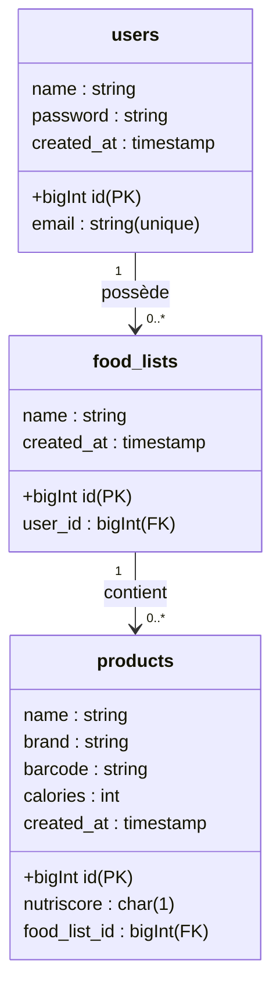

# 🍎 Food-Check : Assistant Nutritionnel & Gestion de Stock

**Food-Check** est une application web performante développée avec **Laravel 11**. Elle permet aux utilisateurs de scanner leurs produits alimentaires, de consulter leurs apports nutritionnels en temps réel et de visualiser l'équilibre de leur consommation via un tableau de bord intelligent.

L'application exploite l'API mondiale **Open Food Facts** pour garantir des données fiables et à jour.

---

## ✨ Fonctionnalités Clés

* 🔍 **Scan Rapide** : Saisie d'un code-barres avec récupération automatique (Nom, Marque, Calories, Nutriscore).
* 📊 **Dashboard de Santé** : Calcul de la moyenne calorique et statistiques globales.
* 🟢 **Analyse Visuelle** : Graphique dynamique (Chart.js) classant les produits en 3 catégories :
    * **Sain** (Nutriscore A & B)
    * **Modéré** (Nutriscore C)
    * **À limiter** (Nutriscore D & E)
* 📋 **Gestion CRUD** : Inventaire complet (Ajouter, Lister, Supprimer).
* 🎨 **Interface Moderne** : Design épuré, rapide et "Mobile First" avec Tailwind CSS.

---

## 🛠️ Architecture Technique & Schéma

Le projet repose sur une structure relationnelle robuste permettant une évolution vers le multi-utilisateur et le partage de listes.

### 🗄️ Schéma de la Base de Données (Concepts)

1.  **Users** : Gère l'accès sécurisé à l'application.
2.  **Lists** : Conteneurs personnels (ex: "Mon Frigo", "Liste de Courses").
3.  **Products** : Stockage des informations nutritionnelles liées à une liste.



---

## ⚙️ Guide d'Installation Complet (Pas à pas)

Ce guide permet d'installer le projet sur n'importe quelle machine, même pour un utilisateur n'ayant jamais utilisé Laravel.

### 1. Prérequis Système
Vous devez installer ces trois outils avant de commencer :
* **PHP (>= 8.2)** : Le langage du serveur.
* **Composer** : Le gestionnaire de paquets PHP. [Télécharger ici](https://getcomposer.org/)
* **Node.js & NPM** : Pour compiler le design et le JavaScript. [Télécharger ici](https://nodejs.org/)

### 2. Procédure d'installation (Lignes de commande)

Ouvrez votre terminal dans votre dossier de projets et exécutez ces commandes :

```bash
# 1. Cloner le projet (Remplacez par votre URL)
git clone [https://github.com/VOTRE_PSEUDO/food-check.git](https://github.com/VOTRE_PSEUDO/food-check.git)
cd food-check

# 2. Installer les dépendances PHP et JavaScript
composer install
npm install

# 3. Configurer l'environnement et la sécurité
cp .env.example .env
php artisan key:generate

# 4. Préparer la base de données SQLite
# (Note : créez d'abord le fichier vide 'database/database.sqlite' manuellement)
# Assurez-vous que DB_CONNECTION=sqlite est configuré dans votre .env
php artisan migrate
